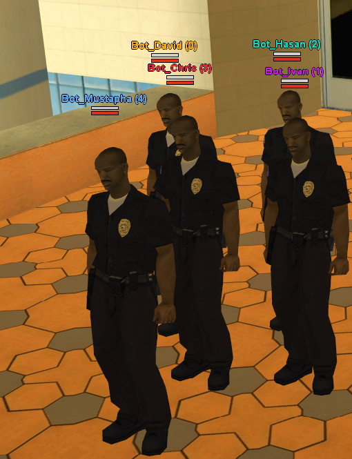

# sampbot

  

A lightweight SA-MP server plugin that makes NPC bots count and show up as regular
players — in the server-browser player count, the client list and the in-game
scoreboard. Works on both Windows and Linux servers.

By default, bots connected with `ConnectNPC` are flagged as NPCs by the server,
so they are excluded from the player count (and even reduce the advertised slot
count). sampbot fixes this: registered bots appear as normal players everywhere,
while their movement is still driven by the NPC client.



## Download

Grab the latest build from the [releases page](../../releases/latest):

- **Windows** — `sampbot-windows.zip` (`sampbot.dll` + `sampbot.inc` + `sampbot.def`)
- **Linux** — `sampbot-linux.zip` (`sampbot.so` + `sampbot.inc`)

## Installation

**Windows**
1. Copy `sampbot.dll` into your server's `plugins/` folder.
2. Add to `server.cfg`: `plugins sampbot`

**Linux**
1. Copy `sampbot.so` into your server's `plugins/` folder.
2. Add to `server.cfg`: `plugins sampbot.so`

Then copy `sampbot.inc` into `pawno/include/`.

## Usage

```pawn
#include <sampbot>

ConnectBot(const nickname[])
{
    PB_RegisterBot(nickname);
    return ConnectNPC(nickname, "npcbot");
}

public OnGameModeInit()
{
    ConnectBot("John_Doe");
    return 1;
}
```

You need an NPC mode script for the bots (for example `npcmodes/npcbot.amx`).

## Native

```pawn
native PB_RegisterBot(const nickname[]);
```

Registers a bot name so it is treated as a real player. Returns `1` on success.

## How it works

SA-MP marks NPC connections with an internal flag that removes them from the
player count, the client list and the scoreboard. sampbot keeps a registry of
your bot names and clears that flag for matching connections, so the server
treats them as ordinary players across all of these paths. Sync is unaffected —
movement still comes from the NPC client.

## Building

The [SA-MP plugin SDK](https://github.com/maddinat0r/samp-plugin-sdk) and
[urmem](https://github.com/urShadow/urmem) are included as submodules, so clone
recursively:

```bash
git clone --recursive https://github.com/hsangrento/samp-bot
```

(or run `git submodule update --init --recursive` in an existing clone).

**Windows** (Visual Studio 2022 + CMake):

```bat
cmake -S . -B build -A Win32
cmake --build build --config Release
```

**Linux** (g++ multilib + CMake):

```bash
sudo apt-get install g++-multilib
cmake -S . -B build -DCMAKE_BUILD_TYPE=Release
cmake --build build
```

Both platforms are also built automatically on every tagged release.

## Compatibility

SA-MP `0.3.DL-R1` (Windows and Linux).

## License

Released under the Creative Commons Attribution-NonCommercial 4.0 International
(CC BY-NC 4.0) License. See [LICENSE](LICENSE).
